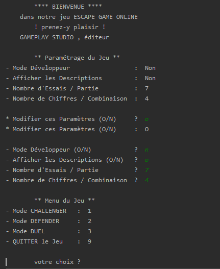

# Jeu:&nbsp;&nbsp;**EscapeGameOnline**

## Editeur:&nbsp;&nbsp;*Gameplay Studio*

### Programmeur:&nbsp;&nbsp;jmAmar (OpenClassrooms)

### Version:&nbsp;&nbsp;1.0 -Octobre 2019-

-----

Description Générale du Jeu :

EscapeGameOnLine est inspiré de celui où une équipe de joueurs est enfermée dans une pièce.
Pour en sortir ils doivent résoudre des égnimes scénarisées."

Dans notre jeu les égnimes sont concrétisées par des séries de chiffres (de 0 à 9) à deviner et/ou déduire.

Le nombre de chiffres de chaque série est déterminé en début de partie (4 par défaut).

Un chiffre peut être redondant une ou plusieurs fois dans une même série (exemples: 12325 , 2222).

3 modes sont proposés :
* mode CHALLENGER (le joueur doit deviner les chiffres de la série déterminés aléatoirement par le logiciel).
* mode DEFENDER (le joueur détermine les chiffres de la série et le logiciel doit les deviner).
* mode DUEL (le joueur et le logiciel jouent à tour. Le gagnant est le premier qui a trouvé la combinaison de l'autre).
 
 *Remarque:* le nombre d'essais pour chaque partie est limité.
 
 -----
 
 Lancement du Jeu :
 
 Placez les fichiers :
 1. OCR-EscapeGameOnline.jar
 2. EscapeGameOnlineProperties
 3. README.md
 
 dans un répertoire où vous souhaitez que le jeu s'exécute.
 
 Puis ouvrez votre Invite de Commande (sous Windows) ou votre Terminal (sous MacOS ou Linux) et saisissez l'instruction suivante :
 
 &nbsp;&nbsp;java -jar OCR-EscapeGameOnline.jar

-----

Configuration du Jeu :

Les paramètres du jeu sont stockés dans un fichier de configuration. Au démarrage le logiciel vous affiche ces paramètres.
vous avez la possibilité de les conserver ou de les modifier.

-----
Présenation du Menu de Paramétrage puis du Menu de d'Exécution du Jeu :

 -----
 
 Compilation du Jeu :
 
 EscapeGameOnline a été programmé en *Java* sous l'IDE (Integrated Development Environment) *IntelliJ* -community edition- de l'éditeur JetBrains.
 
 Le projet a été intégré à Apache *Maven* permettant sa compilation avec l'intégration des dépendances (fichiers sources, librairies, etc.).
 
 ----- 

    
    
